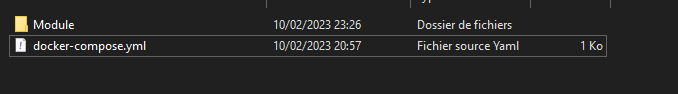
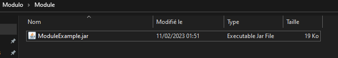
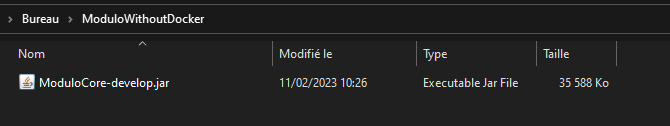
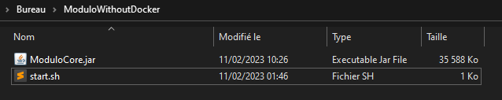
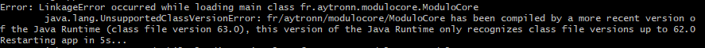
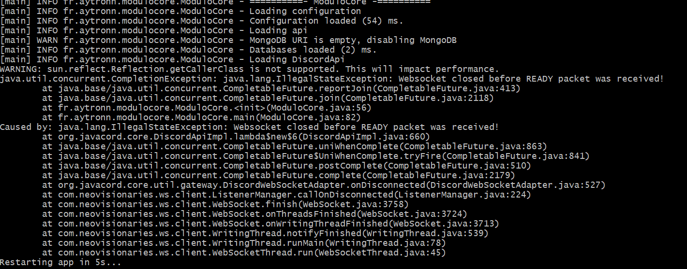

# Modulo
Create your bot discord more easily with Modulo. Allows you to add features easily with modules.
You can see it as a minecraft server with plugins. Modulo will load the modules you added in the modules folder.

## Summary

- [How to build](#how-to-build)
- [How to deploy](#how-to-deploy)
- [How To Developers](#how-to-developers)
- [Basic Usage](#basic-usage)

## How to build

```sh
./gradlew clean shadowJar
```

### Environment variables

- `PROJECT_VERSION` - the version of the project - default: `develop`
- `USERNAME` - the maven user - default: ``
- `TOKEN` - the maven pass - default: ``
- `REPO_URL` - the maven repo - default: ``

<br/>
This will build the project.

## How to deploy

### How to deploy the jar

To publish the jar on the maven repo, you need to set the environment variables.

```sh
./gradlew clean build publish
```

To publish the docker image, you need to login to docker hub.

```sh
echo yourPassword | docker login -u yourUsername --password-stdin
```

And then you can publish the docker image.

```sh
./gradlew clean shadowJar dockerPushDockerHub
```

## How To Developers

### How to add the dependency
```xml
<repository>
    <url>"https://maven.pkg.github.com/aytronnn/Modulo"</url>
</repository>
```
* Artifact Information:
```xml
<dependency>
    <groupId>fr.aytronn</groupId>
    <artifactId>modulo-api</artifactId>
    <version>latest</version>
</dependency>
 ```

**Or alternatively, with Gradle:**

* Repository:
```kotlin
repositories {
    maven {
        url = uri("https://maven.pkg.github.com/aytronnn/Modulo")
    }
}
dependencies {
    compileOnly("fr.aytronn:modulo-api:latest")
}
java {
    toolchain.languageVersion.set(JavaLanguageVersion.of(19))
}
```
### How to lunch the bot with docker

You will need to install [docker](https://docs.docker.com/desktop/) and [docker-compose](https://docs.docker.com/compose/install/).

You can launch the bot with a docker compose. By creating a `docker-compose.yml` file and filling it like this:

```yml
version: '3'
services:
  app:
    container_name: Modulo
    image: aytronn/modulo:latest
    build: .
    ports:
      - "8080:8080"
    environment:
      - BOT_TOKEN=YourToken
    volumes:
      - ./Module:/home/app/ModuloCore/modules/
```

Then you create a `Module` folder.



And in this folder you put your modules.



To launch the bot you return in the folder where there is the file `docker-compose.yml` and you make:

```sh
docker-compose up -d
```

### How to lunch the bot without docker

You will have to pull the project.

```sh
git clone https://github.com/aytronnn/Modulo.git
```

Then the build with gradle.

```sh
./gradlew clean shadowJar
```

Then you go to the `build/libs` folder and launch the jar.
And you copy the `.jar` file to a folder.



Then you will have to create a `start.sh` file and fill it like this:

```sh
#!/bin/bash
while true; do
    java -jar ModuloCore.jar
    echo "Restarting app in 5s..."
    sleep 5s

done
```

Now you should have a file like this:



You can now launch the bot with the command:

```sh
./start.sh
```

If you have this error:



Your java version is not the right one. You must have version 19 of [java](https://www.oracle.com/java/technologies/javase/jdk19-archive-downloads.html).

Once launched you should have this error:



This is normal you should also have created a `ModuloCore` folder and in this folder a `configuration.json` file like this:

```json
{
  "mongoUri": "",
  "botToken": ""
}
```

You will have to fill in the `botToken` field with your bot token. And if you need to use the database you will have to fill in the `mongoUri` field with your mongo uri.

Now you can launch the bot with the command:

```sh
./start.sh
```

And that's it, the bot is launched. You can now create your modules. And put them in the `modules` folder which is in the `ModuloCore` folder.

## Basic Usage

### Create a module

```java
public class Example extends IModule {
    private static Example instance;
    private Config config;

    private TorrentManager torrentManager;

    @Override
    public void onEnable() {
        instance = this;
        getLogger().info("Starting Example...");

        registerListeners();
        registerCommands();
    }

    public void registerListeners() {
        registerListener(new ExampleListener());
    }

    public void registerCommands() {
        registerCommand(new ExampleCommand());
    }

    public static PlexFTH getInstance() {
        return instance;
    }
}
```

### Create a command


```java
public class ExampleCommand {

    @Command(name = "plexfth.clear", subCommand = {"nbMessage"}, subCommandType = {SlashCommandOptionType.DECIMAL}, description = "Clear the channel")
    public void clearCommand(CommandArgs arg) {
        //Do some code for clear the channel
        
        //Mandatory to respond to the command
        arg.getCommandInteraction().createImmediateResponder()
                .setContent("Clear command")
                .setFlags(MessageFlag.EPHEMERAL)
                .respond();
    }
}
```

### Create a listener

```java
public class ExampleListener implements MessageCreateListener {
    
    @Override
    public void onMessageCreate(MessageCreateEvent event) {
        event.getChannel().sendMessage("Thank you for message! <@" + event.getMessageAuthor().getIdAsString() + ">");
    }
}
```

### Credits

For more information, see the [wiki](https://javacord.org/wiki/basic-tutorials/interactions/commands.html#creating-a-command) of [Javacord](https://github.com/Javacord/Javacord) this is the api I use to make the CoreBot.